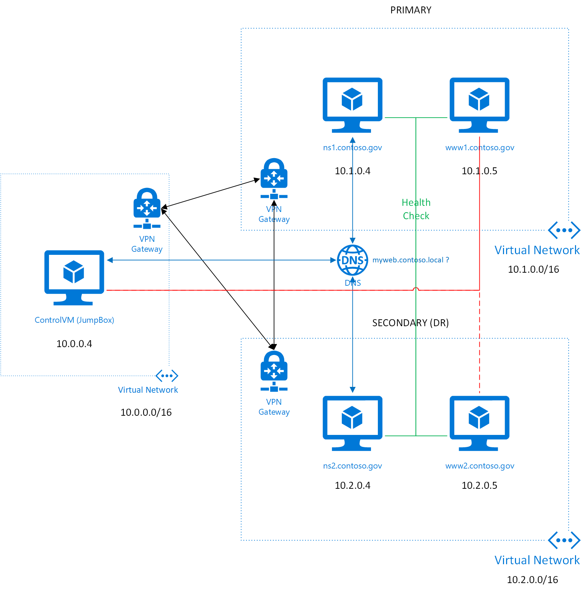

# Connected VNET topology with Private DNS and Private Traffic Manager

This template deploys three (3) virtual networks in three different cloud locations in Azure and connects the three virtual networks with VPN connections. In two of the regions there are web servers and traffic is routed to the primary region if available and otherwise to the secondary. The clients are sent to the correct region using a private traffic manager configuration.

Authorative DNS servers (PowerDNS) are established in two regions and the [Polaris Global Server Load Balancer](https://github.com/polaris-gslb/polaris-gslb) is deployed in conjunction with PowerDNS. 

Polaris GSLB is an Open Source Global Traffic Manager, which can be configured to monitor multiple end-endpoints and via DNS answers send clients to the correct location based on availability, performance, etc. 

In each of the regions that have a private DNS server, the template also establishes a small VM with an nginx web server running in a Docker container. The Polaris GSLBs monitor the two web servers for health and direct clients to the correct region based on availability.

In the first region, the template establishes a Windows VM (a jumpbox). That first region could be though of as an on-prem network peered with two cloud regions. In this example, the jump box has a public IP address, but we could have eliminated that and established the connection to the first region through a Point-To-Site VPN connection. Or in a more realistic scenario, the jump box would be on the on-prem private network. 
 
The template does not use features such as Docker Extension, etc. This allows this pattern to be deploy in both Azure Commercial Cloud and Azure Government Cloud. 

<a href="https://portal.azure.us/#create/Microsoft.Template/uri/https%3A%2F%2Fraw.githubusercontent.com%2Fhansenms%2FPrivateTrafficManager%2Fmaster%2FPrivateTrafficManager%2Fazuredeploy.json" target="_blank">

